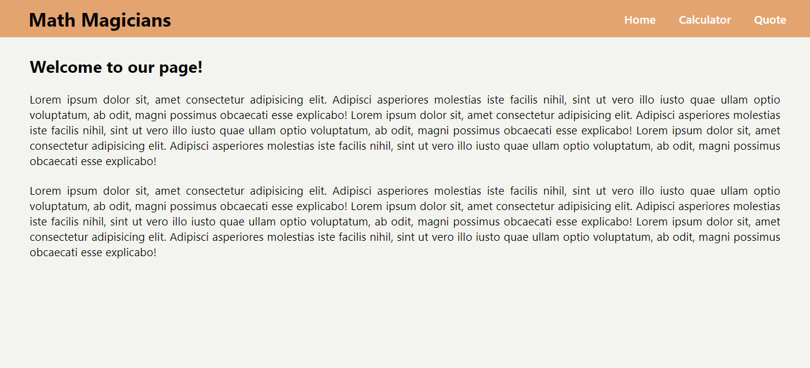

   

# React App: math-magicians

> This is the first React app project under the Microverse program.
> The App contains three pages (Home, Calculator and Quote).
> It will be developed in multiple stages, and currently it is in its initial setup stage of development.



## Built With

- **HTML**
- **CSS**
- **JavaScript**
- **GitHub flow**
- **Linters**
- **React**
- **Node**
- **Babel**

## Getting Started

### Steps to run the project

#### 1 - Git Clone.

```
git clone https://github.com/normainobary2021/math-magicians.git
```
#### 2 - Install node packages.

```
npm install
```

#### 3 - run the project

```
npm start
```

## Available Scripts

In the project directory, you can run:

### `npm start`

Runs the app in the development mode.

### `npm test`

Launches the test runner in the interactive watch mode.

### `npm run build`

Builds the app for production to the `build` folder.

### `npm run eject`

**Note: this is a one-way operation. Once you `eject`, you can't go back!**

If you aren't satisfied with the build tool and configuration choices, you can `eject` at any time. This command will remove the single build dependency from your project.

## Author
### 👨‍💻 Norman Ainobushoborozi
- GitHub: [@normainobary2021](https://github.com/normainobary2021)
- Twitter: [@NormanAinobush2](https://twitter.com/NormanAinobush2)
- LinkedIn: [Norman Ainobushoborozi](https://www.linkedin.com/in/norman-ainobushoborozi/)

## 🤝 Contributing

Contributions, issues, and feature requests are welcome!

Feel free to check the [issues page](https://github.com/normainobary2021/math-magicians/issues).

## Show your support

Please give a ⭐️ if you like this project!

## 📝 License
- This project is [MIT](https://github.com/normainobary2021/math-magicians/blob/setup/MIT.md) licensed.